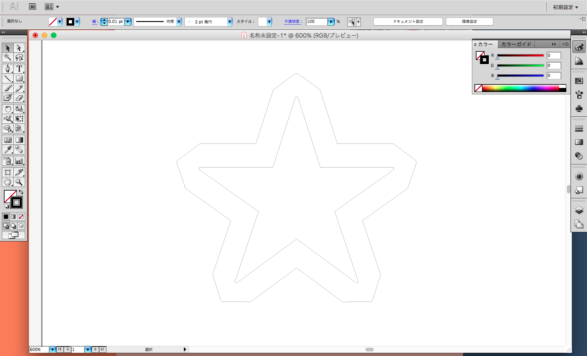
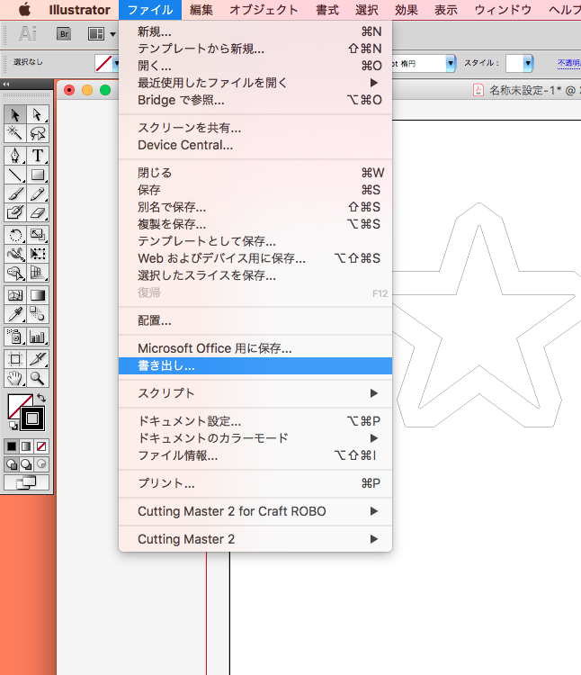
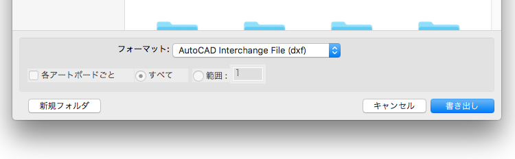
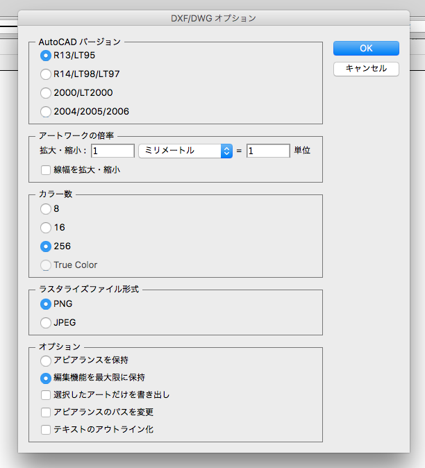

# 01.データの設定
  

## ★データ作成に使用するソフトウェアの例
 

**2Dデータ**

* **Adobe Illustrator（有料）：** [http://www.adobe.com/jp/products/illustrator.html](http://www.adobe.com/jp/products/illustrator.html)
* **Inkscape（無料）：** [https://inkscape.org/ja/](https://inkscape.org/ja/)
* **Method Draw（無料）：** [http://editor.method.ac/](http://editor.method.ac/）)

 
 
 

## ★データ形式
 

* **ソフトで読み込んだらそのまま加工可能：**.dxf  
* **ソフト上でデータを修正する必要あり：**.jpg、.png.、.gif

事前にデータ変換を行いたい場合は、以下のリンク先よりソフトウェアをダウンロード&インストールしてください。 
（※必ず、ページ下部の「CAMEO Silhouette Studio」をダウンロードすること。） 
[http://silhouettejapan.jp/download/index.html](http://silhouettejapan.jp/download/index.html)

 
 

## ★必要なデータ
 

* **カッティング保証範囲（データのサイズ） ：** 
幅295mm × 長さ1016mm ／ 台紙使用時は幅305mm × 長さ305mm

 
 

## ★Adobe Illustratorでdxf形式のデータを作る場合
 

**1.** 以下の条件でデータを作成します。 

 

* **データのカラーモード：**RGB  
* **カット線の太さ：**0.01pt  
* **カット線の色：**R0 B0 G0
 
 

**2.** **ファイル** ＞ **書き出し**を選択します。 

 

 
 

**3.** フォーマット**「dxf」** を選択し **「書き出し」**をクリックします。 

 

 
 

**4.** 以下のように設定し**「OK」**をクリックします。 

 

 
 
