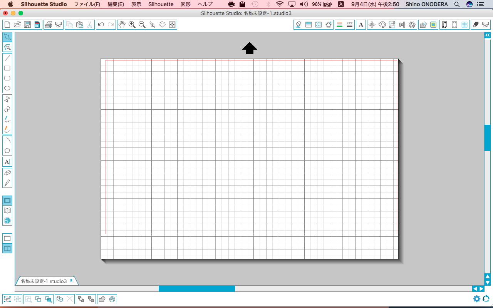
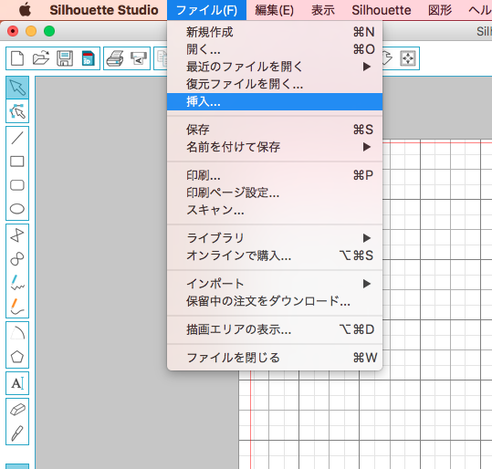
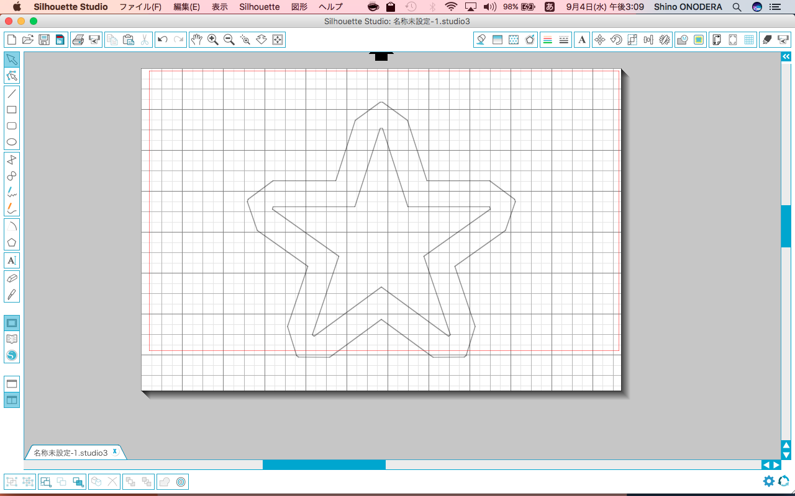
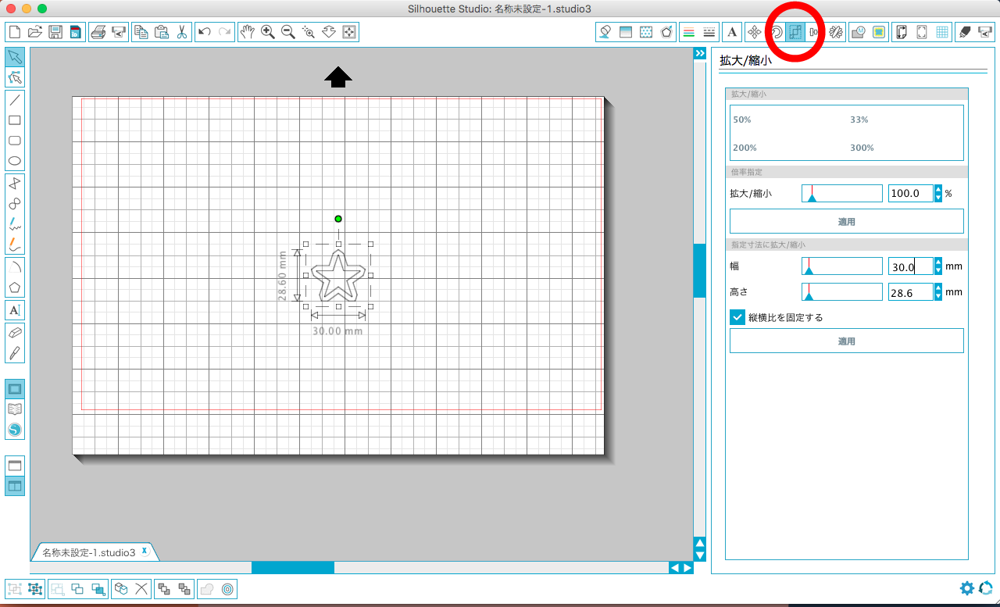
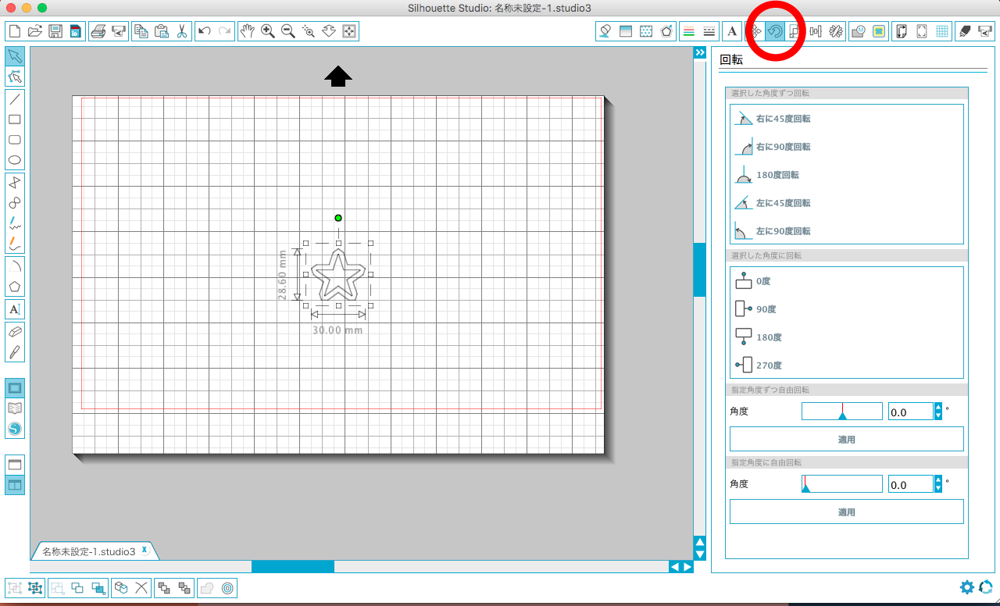
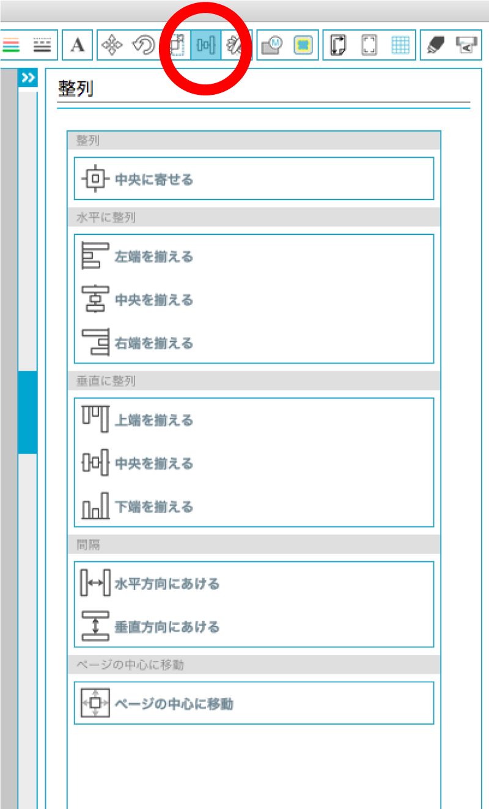
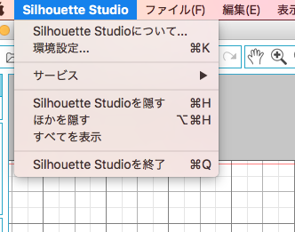
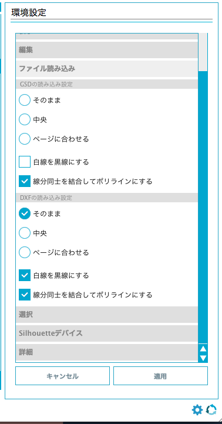

# 02-1.dxfデータの読み込み・調整
  

ここでは、あらかじめ用意された**dxf**データを、 
カッティングプロッタ用ソフトウェアに読み込む方法を説明します。 
 
 

 
 

 [Silhouette Studio](http://silhouettejapan.jp/download/index.html)を起動します。 
 
 

 
  

**“ファイル”** ＞ **“挿入”** を選択し、読み込みたいdxfデータを開きます。 
 
 

  

**「拡大/縮小」ボタン**を押すと、データのサイズを変更することができます。 
 
 

  

**「回転」ボタン**を押すと、データの角度を変更することができます。 
 
 

  

**「整列」ボタン**を押すと、複数のデータの位置を揃えたり、 
ページの中心等にデータを移動させることができます。 
 
 
 

**※読み込み時にdxfデータのサイズが変わってしまうときは、以下のように設定しなおしてください。**
 

  

**“Silhouette Studio”** ＞ **“環境設定”** を選択します。 
 
 

  

**「ファイル読み込み」** のDXFの読み込み設定 **「そのまま」** にチェックを入れます。 
