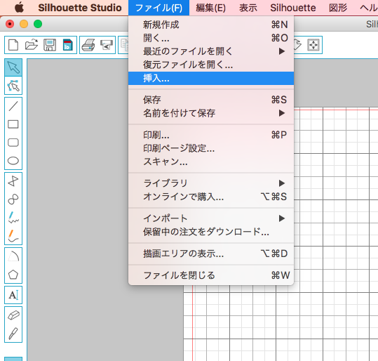

# 02-2.jpg等のデータの変換・調整
  

ここでは、**jpg**データなどの画像データを、 
カッティングプロッタ用ソフトウェアでデータ変換する方法を説明します。 
 
 

 
 

 [Silhouette Studio](http://silhouettejapan.jp/download/index.html)を起動します。 
 
 

 
  

**“ファイル”** ＞ **“挿入”** を選択し、jpg、png形式などの画像データを開きます。 
 
 

  

**「輪郭抽出」**ボタンをクリックします。 
 
 

  

**「抽出領域を指定する」**をクリックします。 
 
 

  

カットラインに変換したい画像を、**長押しクリック＋ドラッグ**で選択します。 
 
 

  

**「抽出方法を選んで実行」**のうち、好きなものを選択します。 
 
 

  

**「単純トレース」**を選択すると、上記のようなカットラインが生成されます。 
 
 

  

**「外縁をトレース」**を選択すると、上記のようにカットラインが生成されます。 
