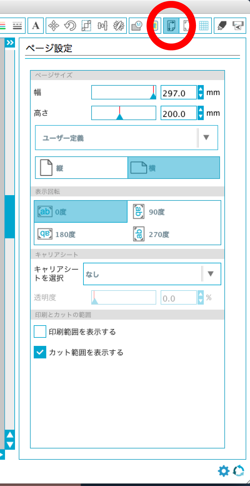
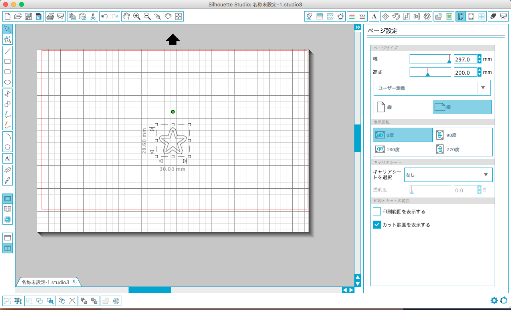
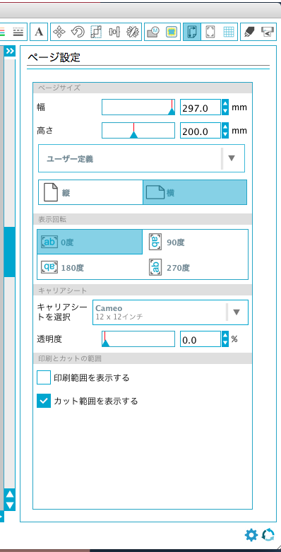
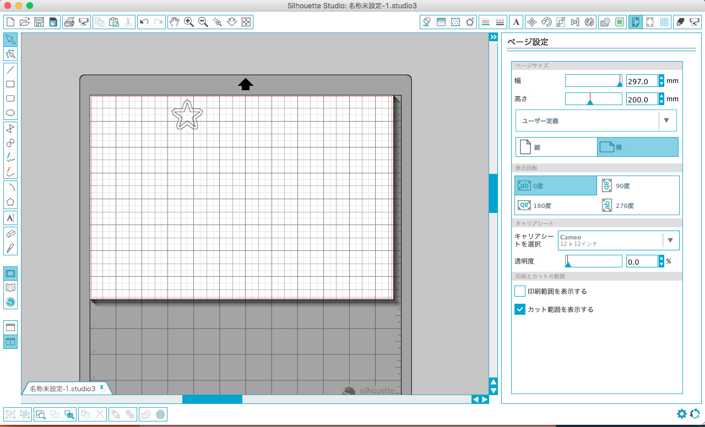
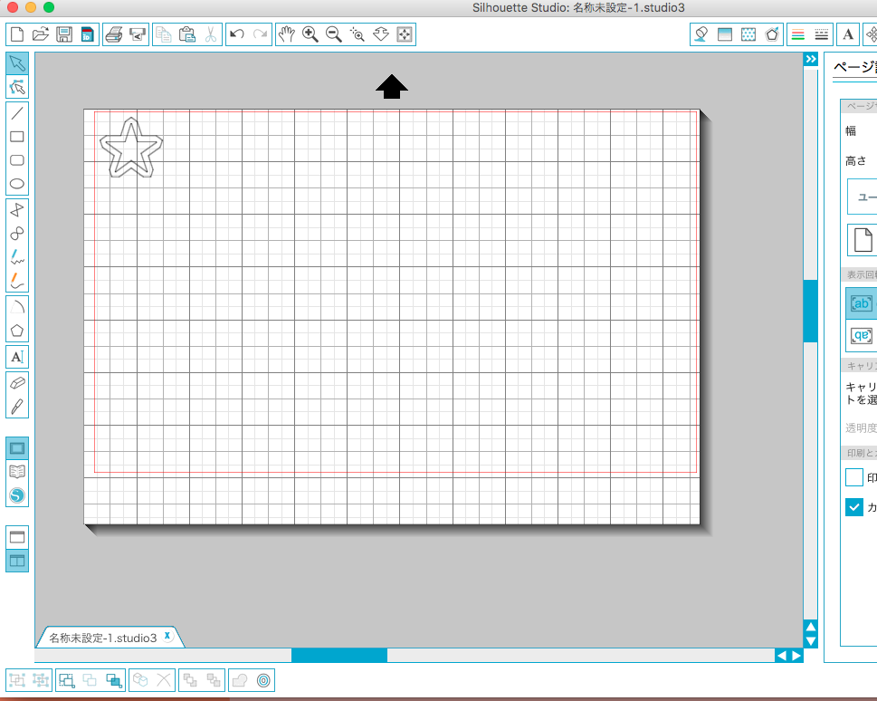

# 03.ページの設定
  

 
 

カットする台紙のサイズを設定します。画面右上の**「ページ設定」**をクリックします。 
 
 

  

使用する用紙のサイズを**「ページサイズ」**の数値入力欄に入力します。 
また、カッティングシートなどのように、カットしたいシートの下に 
台紙が貼られているものをカットする場合には**「キャリアシートを選択」**を**「なし」**に設定します。 
 
 
 

  

画用紙やフィルムなどのように、カットしたいシートが台紙に貼り付けられていない場合には、 
キャリアシートと呼ばれる台紙を使用する必要があります。 
その際には**「キャリアシートを選択」**を**「Cameo 12 x 12インチ」**に設定します。 
 
 

  

上記のように設定すると、台紙の下にグレーのキャリアシートが表示されます。 
 
 

  

加工データを、台紙イメージの赤枠内の任意の場所に移動します。（赤枠内が加工可能範囲です。）
