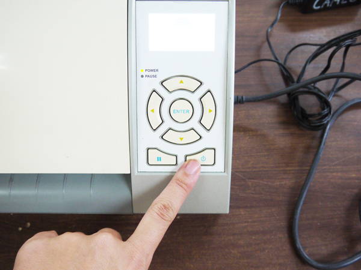
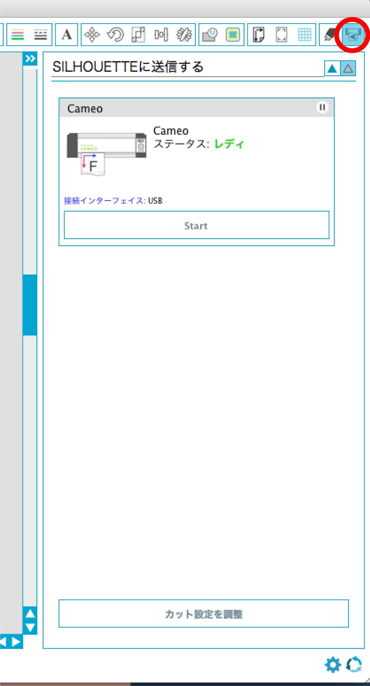
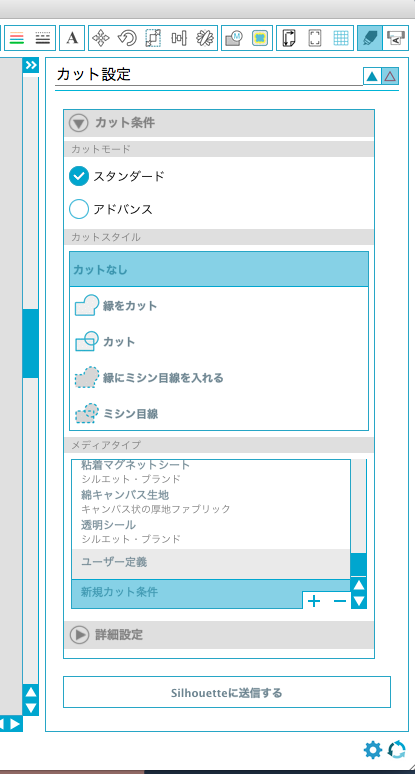
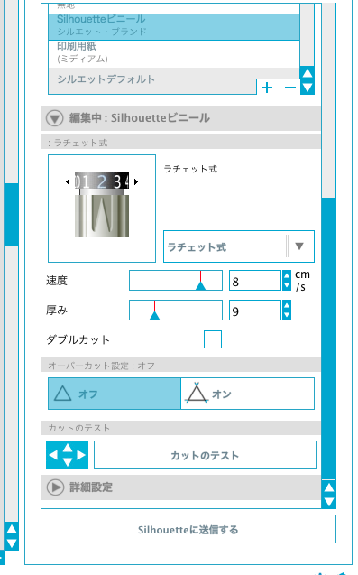
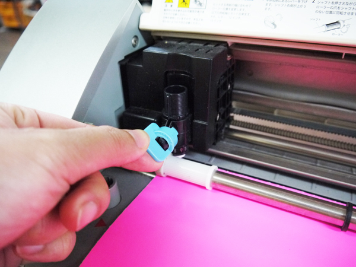
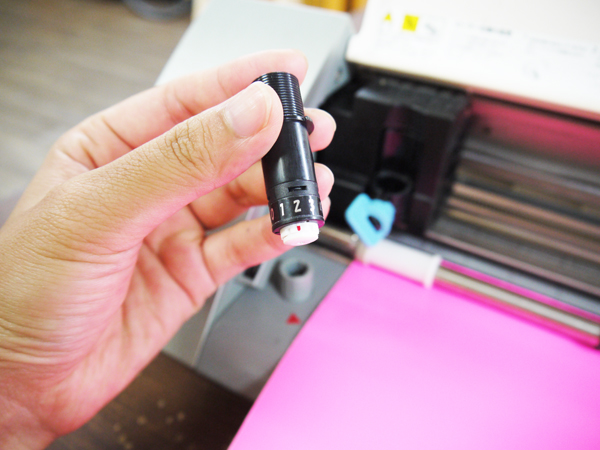
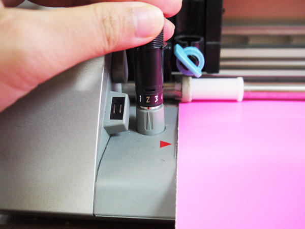
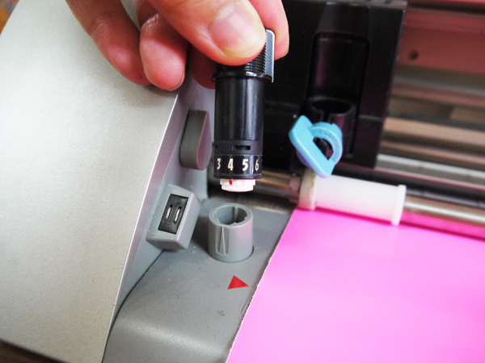
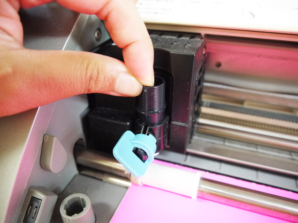
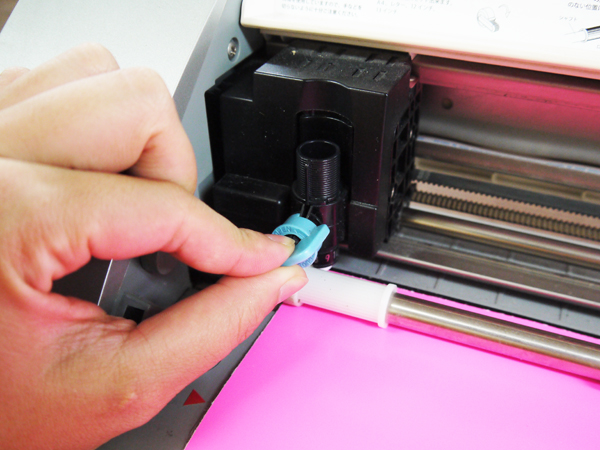

# 04.加工設定、マシンのセットアップ
  

 
 

マシンとPCが接続されていることを確認し、マシンの電源を入れます。 
 
 
 

  

**「SILHOUETTEに送信する」**ボタンをクリックし**「カット設定を調整」**をクリックします。 
 
 
 

  

以下のようにカットの設定をします。

* **カットモード：**「スタンダート」を選択  
* **カットスタイル：**「カット」を選択  
* **メディアタイプ：**使用するシートに近いものを選択、もしくは新規カット条件を選択
 
 
 

  

メディアタイプを選択すると、上記のような入力項目が表示されます。 
各項目について、使用する材料に合わせて数値などを変更します。 
 
 
 

  

**ラチェット式**という項目に表示されている数値と、マシンにセットされているブレードの数値を合わせます。 
はじめに、ブレードが取り付けられている箇所の**水色のレバー**を左に回します。 
 
 
 

  

そうすると、ブレードの上部を持って上に引っ張り、マシンから取り外すことができます。   
赤い印がついている数値が、現在のブレードの長さです。 
 
 
 

  

ブレードの長さを変更する場合、赤い印とグレーの三角形の頂点の位置が合うように、 
まずはグレーの円筒にブレードをしっかり差し込みます。 
その状態のまま、グレーの三角形の頂点が数値の位置にくるまでブレードを回転させます。 
 
 
 

  

設定が完了したらブレードを取り外します。 
 
 
 

  

ブレード上部の突起が、正面を向くようにセットし直します。 
 
 
 

  

水色のレバーを右に回し、ブレードを固定したらセットアップ完了です。 
 
 
 
