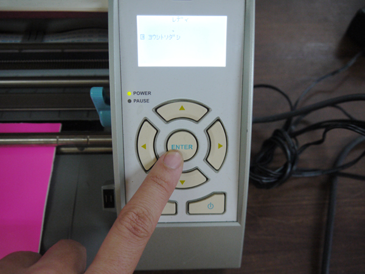

# 05-1.用紙のセット（台紙なし）〜加工
  

 
 

ここでは、上のようなカッティングシートなどのように、 
カットしたいシートの下に台紙が貼られているもののセット及び加工方法を説明します。 
 
 
 

  

**シートの左端**を、マシンの**赤い三角形右の短いライン**に合わせます。 
 
 
 

  

**シートの上端**を、白いストッパーの下に入り込むようにぴったりと合わせます。 
 
 
 

  

**「ヨウシセット ダイシナシ」**にセットし、**「ENTER」ボタン**を押します。 
 
 
 

  

白いストッパーが回転し、シートが送り込まれます。 
 
 
 

  

**「Silhouetteに送信」**をクリックすると加工がスタートします。 
 
 
 

  

加工が完了すると、マシンのディスプレイに**「ヨウシトリダシ」**と表示されるので、 
問題がなければ**「ENTER」」ボタン**を押します。 
 
 
 

  

そうするとシートが手前に送り出されてきます。 
 
 
 

  

シールの完成です。 
