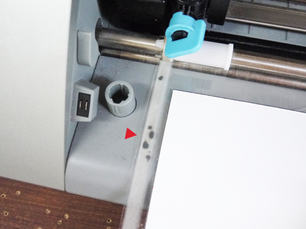

# 05-2.用紙のセット（台紙あり）〜加工
  

 
 

ここでは、上のような画用紙のように、加工するシートの下に 
台紙（キャリアシート）を貼り付ける必要のあるもののセット及び加工方法を説明します。 
 
 
 

  

加工したいシートを、台紙（キャリアシート）の黒枠に合わせて貼り付けます。 
 
 
 

  

[台紙なしのとき](/05-cutting1.md)と同じように、シートをマシンにセットします。   
今回は台紙（キャリアシート）の左端を赤い三角形に、上端を白いストッパーに合わせます。
 
 
 
 

  

**「ヨウシセット ダイシアリ」**にセットし、**「ENTER」ボタン**を押します。 
 
 
 

  

**「Silhouetteに送信」**をクリックすると加工がスタートします。 
 
 
 

  

加工が完了すると、マシンのディスプレイに**「ヨウシトリダシ」**と表示されるので、 
問題がなければ**「ENTER」」ボタン**を押します。そうするとシートが手前に送り出されてきます。 
 
 
 

  

加工完了です。 
