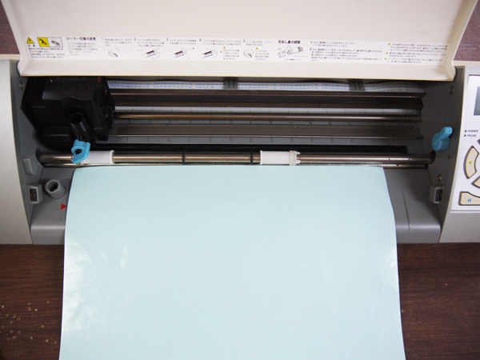
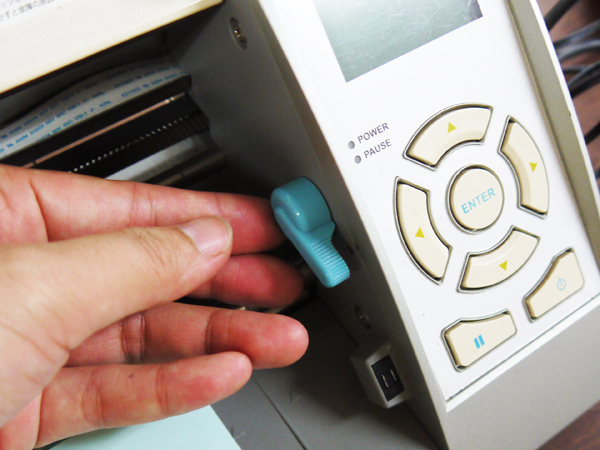
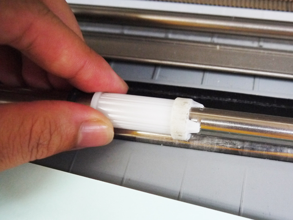
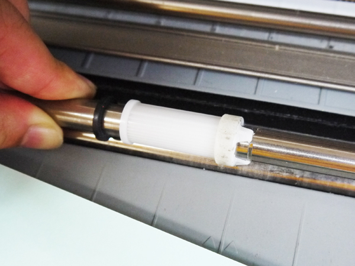
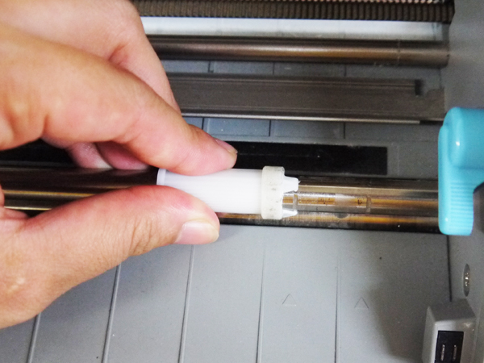
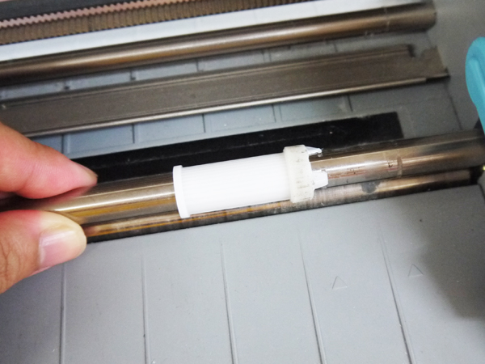
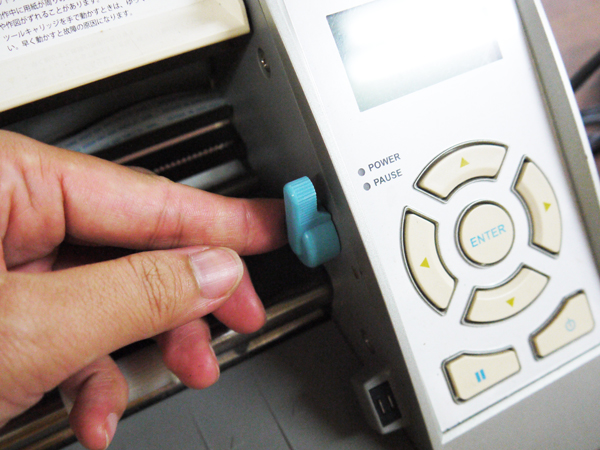
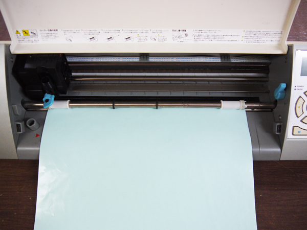

# 06.ストッパーの移動方法
  

 
 

使用するシートやキャリアシートのサイズによっては、白いストッパーの位置を変更する必要があります。 
左側のストッパーの位置は変更できないが、右側のストッパーは変更可能です。 
 
 
 

  

マシン右側の水色のレバーを手前に倒します。 
 
 
 

  

左手でシルバーの棒を抑え、右手で右側のストッパーを回転させるます   
（ストッパーの右端の爪が、シルバーの棒の溝に食い込んでいるので、それを取り外します。）
 
 
 
 

  

ストッパーの爪が、シルバーの棒の溝から外れました。（爪の先端の間に、棒の溝が見えます。） 
 
 
 

  

ストッパーを任意の位置まで移動させます。（爪をはめ込むための溝があるところまで。）
 
 
 
 

  

ストッパーを回転させ、爪をシルバーの棒の溝に再度はめ込みます。 
 
 
 

  

マシン左側の水色のレバーを上にあげます。 
 
 
 

  

これでストッパーの移動は完了です。 
 
 
 
